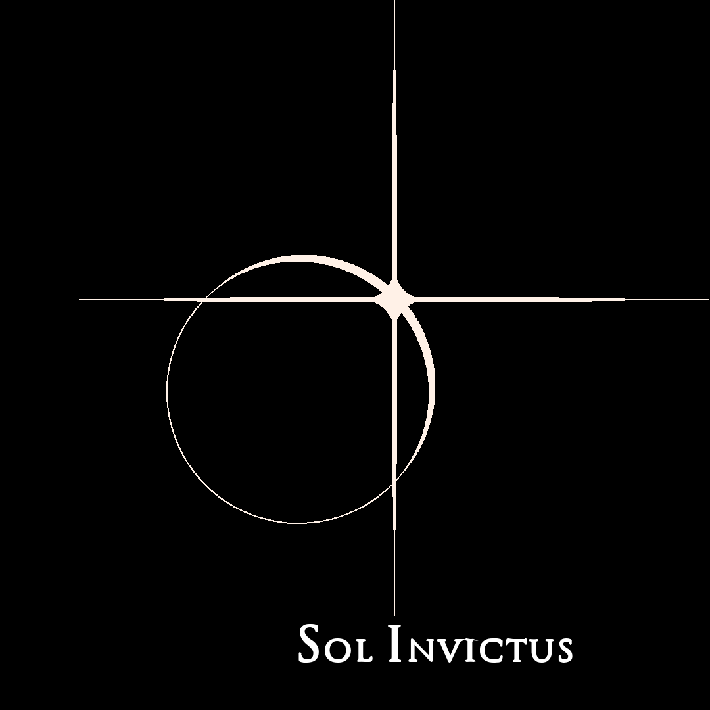

# Sustainable Space

#### Preface

I've always swum upstream. One doesn't get very far, very fast doing this.

I'd long often felt the shadow of the Leviathan lurking in the depths perpetually flowing downstream. His hideous visage now, here and there, crests the surface, bringing an ocean of turmoil.

Chthulu, murky invertebrate god of the material world, swims ever leftward. That doesn't mean we need to join him.

---

Space travel is today out of reach for all but the wealthiest of men and the justification for doing so the flimsiest of ego-gratification. To establish a true foothold in space, there must be both enough economic drive _and_ reachability for at least a critical mass of humans.
Due to the nature of escaping the gravity well, the cost of working in space has a hard floor, even after commoditization of orbital lift. Therefore, profit (currently at zero) will have to be significant to offset those costs. 

Total dependence on Earth resources means _everything_ must incur lift costs. Life support consumables will be the majority of these costs. However, as more air, food, water, energy, and equipment can be produced in-situ, costs plummet per person down to simply getting that person into orbit.

Note that while Mars is a tempting stepping-stone, it is another gravity well, shallower but still significant.

There are a number of undefined quantities here, namely:
* what is the lowest cost per kilo (or per person) for orbital lift? (Currently US$20K/k or US$1.6M per average male)
* what is the number of humans in space that would constitute a critical mass? (Dunbar number)
* how could enough energy be produced in space? (fusion)
* how can we acquire either enough water, or enough oxygen (each can be converted easily to the other)? (fusion!)
* how could sufficient food be produced without the need for orbital lift? (agro habitats)
* given the extreme fragility of life in space, how do we avoid killing one another (cooperation is mandatory, but difficult)? (social tech)

These will be explored below, but there is one critical question underlying these that must be answered first: 

Why?

## The Why

### Foundations

One must start somewhere, make some fundamental assumption. So let's begin with the long-traditional assumption that the Logos exists and moves the world. I don't mean the gelded Aristotelean logos, meaning mere logical argument, but the older, richer Heraclitean and later Christian meaning: the rational and divine structure of the universe. In our dangerously cataclysmic universe, the fact that the orderliness of life exists (demonstrably) is downright miraculous.

Modernity has little to offer but corruption. Atheism (as opposed to agnosticism) is dishonest - almost as a tautology; likewise modern physics, inasmuch as it holds to atheistic views.

I'm not arguing for an impossible return to an older time, but rather a future that acknowledges that our forefathers were thoughtful, cooperative, and generally _good_ men. *Your* traditions (which are not necessarily *mine*) represent tens of thousands of years of collected knowledge of *your* forefathers, subtly distilled, sometimes corrupted in places. We have the scientific method, we should honestly apply it to Tradition to separate the wheat from the tares. Certainly it should not be simply discarded.

Many other men, more intelligent and eloquent than I, have effectively argued for the existence of the Logos for centuries. It is, in fact, the basis of Western thought and civilization. A Classical education is left as an exercise for the reader. If you've educated yourself even just a little (and yes, you have to do this on your own, the institutions are no longer trustworthy), you'll find that the godless philosophy of the twentieth century has led directly to the numerous catastrophes of that century, and to the whirlwind of chaos we are now reaping. 

Let us retreat then to the metaphysics of Gottfried Leibniz in the early 18th century. Leibniz is famous for co-discovering calculus with Newton, and for being lampooned hard by Voltaire in *Candide*. Voltaire, as a typical celebrity-seeking ur-leftist, simply (or willfully) failed to understand the deep subtlety in what Leibniz meant by "the best of all possible worlds" and effectively buried the beginnings of a strong philosophical basis for understanding the world and our place in it.

Why Leibniz? He was a brilliant scientist with a deep faith in God. Whereas Newton was highly focussed, Leibniz' investigations are extremely broad, but often unfinished. He wanted to know the answers to everything.

In the above quoted mockery, what was Leibniz pointing toward? 
 - maximal goodness (given the nature of chaos) [Irenaean theodicy, i.e. school for the soul]
 - simply observe clearly, without bias, Darwinian mechanisms within human society
 - human solipsism and objections to theodicy
 - creation requires choices, limits

(Topics)
 - benevolent patriarch
 - the role of hardship (and women)
 - commandment to reproduce
 - limited resources, mouse utopia
 - per aspera ad astra ("through hardships to the stars")
 - time is running out
 - reprieve on Mars
 - the sustainable goal: scattered orbital colonies
 

## The How
 
### Rethinking physics
 
If gravity is the bending of space by mass, then space must have substance. Geometry without substance is non-physical.

If Einstein was wrong, what is the mechanics of gravity?
Options: space does have substance (aether), in which case we should characterize it, or not - which leaves gravity (and electromagnetism) without a mechanism. A gravitational/electric/magnetic field ought to have a conduit for the flux. "Charges generate fields", how (via what), i.e. still action-at-a-distance?

Is the photon a particle or a wave or both? Photoelectric effect. Does it have mass? (It must, it has energy.) The neutrino was thought to be massless, but has been shown to be the lightest particle yet.

Cold fusion
